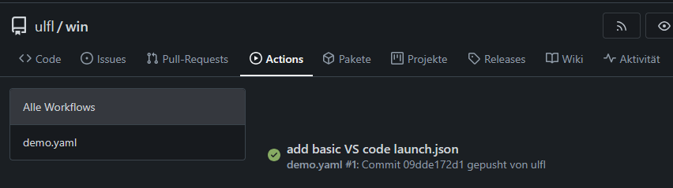
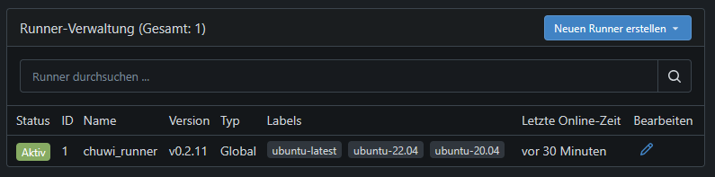

# Gitea Runner

The following is the simplest way I could find to add the execution of actions/workflows to my [Gitea home server](./gitea.md). It uses docker compose to setup a Gitea act_runner container.

> :bulb: **Tip:** Looking at the Gitea documentation, setting up a runner for Gitea actions seems pretty complex and confusing. It's really not that complicated if you know docker compose a bit ...

*The text was written in 2025 and will probably get outdated over time.*



*Gitea Actions run on my home server* :thumbsup:

## Table of Contents

* [Get Registration Token](#get-registration-token)
* Create [docker-compose.yml](#docker-composeyml)
* Create [config.yaml](#configyaml) (copied unchanged from example)
* [Start the Container](#start-the-container)
* [Demo Workflow](#demo-workflow)
* [FIY: Act and Runner Container](#fiy-act-and-runner-container)

---

## Get Registration Token

Hint: My Gitea server is running at: http://myserver:3001

Get a registration token from your Gitea server:

* http://myserver:3001/-/admin/actions/runners (or in gitea: top right icon > Administration > Actions > Runner)
* "Neuen Runner erstellen" (button top right)
* copy "registration token" to clipboard.

You'll get something like: ```1234DmcfOudb53L8pfmWe95gHFMocpa16J5F7890```

Hint: If you use more than one runner container, you can use the same token again.

## docker-compose.yml

Use the following docker-compose.yml (or just add the runner section to an existing Gitea compose file).

```
services:
  runner:
    container_name: gitea_act_runner
    image: docker.io/gitea/act_runner:latest
    restart: unless-stopped
    environment:
      CONFIG_FILE: /config.yaml
      GITEA_INSTANCE_URL: http://myserver:3001
      GITEA_RUNNER_REGISTRATION_TOKEN: 1234DmcfOudb53L8pfmWe95gHFMocpa16J5F7890
      GITEA_RUNNER_NAME: chuwi_runner
      GITEA_RUNNER_LABELS: test_label
    volumes:
      - ./runner/config.yaml:/config.yaml
      - ./runner/data:/data
      - /var/run/docker.sock:/var/run/docker.sock
```

The content is based on https://docs.gitea.com/usage/actions/act-runner  and slightly modified.

**You'll need to adjust two settings:**

* GITEA_INSTANCE_URL: use the URL of your server
* GITEA_RUNNER_REGISTRATION_TOKEN: use the token from the server above

I like to place the containers config in a folder beside the docker-compose.yml, so the volume names start with: ./runner/...

> :warning: **Warning:** Don't start the container yet! If you would start the compose right now, you'll get a directory ./runner/config.yaml which is NOT what's needed.

## config.yaml

Create the runner configuration file:

* touch ./runner/config.yaml
* Copy the example content into the config.yaml file:

```
# Example configuration file, it's safe to copy this as the default config file without any modification.

# You don't have to copy this file to your instance,
# just run `./act_runner generate-config > config.yaml` to generate a config file.

log:
  # The level of logging, can be trace, debug, info, warn, error, fatal
  level: info

runner:
  # Where to store the registration result.
  file: .runner
  # Execute how many tasks concurrently at the same time.
  capacity: 1
  # Extra environment variables to run jobs.
  envs:
    A_TEST_ENV_NAME_1: a_test_env_value_1
    A_TEST_ENV_NAME_2: a_test_env_value_2
  # Extra environment variables to run jobs from a file.
  # It will be ignored if it's empty or the file doesn't exist.
  env_file: .env
  # The timeout for a job to be finished.
  # Please note that the Gitea instance also has a timeout (3h by default) for the job.
  # So the job could be stopped by the Gitea instance if it's timeout is shorter than this.
  timeout: 3h
  # The timeout for the runner to wait for running jobs to finish when shutting down.
  # Any running jobs that haven't finished after this timeout will be cancelled.
  shutdown_timeout: 0s
  # Whether skip verifying the TLS certificate of the Gitea instance.
  insecure: false
  # The timeout for fetching the job from the Gitea instance.
  fetch_timeout: 5s
  # The interval for fetching the job from the Gitea instance.
  fetch_interval: 2s
  # The labels of a runner are used to determine which jobs the runner can run, and how to run them.
  # Like: "macos-arm64:host" or "ubuntu-latest:docker://docker.gitea.com/runner-images:ubuntu-latest"
  # Find more images provided by Gitea at https://gitea.com/docker.gitea.com/runner-images .
  # If it's empty when registering, it will ask for inputting labels.
  # If it's empty when execute `daemon`, will use labels in `.runner` file.
  labels:
    - "ubuntu-latest:docker://docker.gitea.com/runner-images:ubuntu-latest"
    - "ubuntu-22.04:docker://docker.gitea.com/runner-images:ubuntu-22.04"
    - "ubuntu-20.04:docker://docker.gitea.com/runner-images:ubuntu-20.04"

cache:
  # Enable cache server to use actions/cache.
  enabled: true
  # The directory to store the cache data.
  # If it's empty, the cache data will be stored in $HOME/.cache/actcache.
  dir: ""
  # The host of the cache server.
  # It's not for the address to listen, but the address to connect from job containers.
  # So 0.0.0.0 is a bad choice, leave it empty to detect automatically.
  host: ""
  # The port of the cache server.
  # 0 means to use a random available port.
  port: 0
  # The external cache server URL. Valid only when enable is true.
  # If it's specified, act_runner will use this URL as the ACTIONS_CACHE_URL rather than start a server by itself.
  # The URL should generally end with "/".
  external_server: ""

container:
  # Specifies the network to which the container will connect.
  # Could be host, bridge or the name of a custom network.
  # If it's empty, act_runner will create a network automatically.
  network: ""
  # Whether to use privileged mode or not when launching task containers (privileged mode is required for Docker-in-Docker).
  privileged: false
  # And other options to be used when the container is started (eg, --add-host=my.gitea.url:host-gateway).
  options:
  # The parent directory of a job's working directory.
  # NOTE: There is no need to add the first '/' of the path as act_runner will add it automatically. 
  # If the path starts with '/', the '/' will be trimmed.
  # For example, if the parent directory is /path/to/my/dir, workdir_parent should be path/to/my/dir
  # If it's empty, /workspace will be used.
  workdir_parent:
  # Volumes (including bind mounts) can be mounted to containers. Glob syntax is supported, see https://github.com/gobwas/glob
  # You can specify multiple volumes. If the sequence is empty, no volumes can be mounted.
  # For example, if you only allow containers to mount the `data` volume and all the json files in `/src`, you should change the config to:
  # valid_volumes:
  #   - data
  #   - /src/*.json
  # If you want to allow any volume, please use the following configuration:
  # valid_volumes:
  #   - '**'
  valid_volumes: []
  # overrides the docker client host with the specified one.
  # If it's empty, act_runner will find an available docker host automatically.
  # If it's "-", act_runner will find an available docker host automatically, but the docker host won't be mounted to the job containers and service containers.
  # If it's not empty or "-", the specified docker host will be used. An error will be returned if it doesn't work.
  docker_host: ""
  # Pull docker image(s) even if already present
  force_pull: true
  # Rebuild docker image(s) even if already present
  force_rebuild: false

host:
  # The parent directory of a job's working directory.
  # If it's empty, $HOME/.cache/act/ will be used.
  workdir_parent:
```

Example taken (unchanged) from: https://gitea.com/gitea/act_runner/src/branch/main/internal/pkg/config/config.example.yaml

---

## Start the Container

```
docker compose up -d
```

After a minute or so, the new runner should appear in Gitea at: http://myserver:3001/-/admin/actions/runners



*The runner appearing at my Gitea server* :thumbsup::thumbsup::thumbsup:

If you have problems, take a look at the container logs (e.g. by using portainer).

---

## Demo Workflow

To test the actions, let's create a demo workflow.

In an existing repository create the file: ```.gitea/workflows/demo.yaml```

Copy the following content into it:

```
name: Gitea Actions Demo
run-name: ${{ gitea.actor }} is testing out Gitea Actions 🚀
on: [push]

jobs:
  Explore-Gitea-Actions:
    runs-on: ubuntu-latest
    steps:
      - run: echo "🎉 The job was automatically triggered by a ${{ gitea.event_name }} event."
      - run: echo "🐧 This job is now running on a ${{ runner.os }} server hosted by Gitea!"
      - run: echo "🔎 The name of your branch is ${{ gitea.ref }} and your repository is ${{ gitea.repository }}."
      - name: Check out repository code
        uses: actions/checkout@v4
      - run: echo "💡 The ${{ gitea.repository }} repository has been cloned to the runner."
      - run: echo "🖥️ The workflow is now ready to test your code on the runner."
      - name: List files in the repository
        run: |
          ls ${{ gitea.workspace }}
      - run: echo "🍏 This job's status is ${{ job.status }}."
```

Example taken (unchanged) from the "Use Actions" section at: https://docs.gitea.com/usage/actions/quickstart/

Don't forget to commit and push this.

> :bulb: **Tip:** This workflow is now triggered each time you push something into the repository.

To test the action, do another change in the repo and push it.

In the repositories Actions, some activity should show up now ...


*First Action done on my Gitea server* :thumbsup::thumbsup::thumbsup:


The first time the workflow is started, the ```ubuntu-latest``` container image is pulled which takes a minute or two. The following actions reuses the image and are therefore much faster.

---

## FIY: Act and Runner Container

Some background what happens "internally" may help if something doesn't work ...

The act_runner container as setup in the docker-compose.yml won't actually execute the jobs by itself. It creates a different container for this, which is deleted once the workflow is done.

So what's happening, as far as I understand it ...

* act_runner container starts, based on the image: ```docker.io/gitea/act_runner```
* act_runner tells gitea server "I can provide: ```ubuntu-latest```, ubuntu-22.04 and ubuntu-20.04"
* act_runner waits for new jobs

... as time goes by ...

* Gitea asks act_runner to do some jobs on ```ubuntu-latest```
* act_runner asks docker to start the "runner" container:
  * based on the image: ```docker.gitea.com/runner-images:ubuntu-latest```
  * docker pulls the image and starts the container
* act_runner runs the jobs in the runner container
* act_runner deletes the runner container again
* act_runner tells Gitea: "job done"and waits for new jobs

Beside the ```ubuntu-latest``` image there are different runner variants of Ubuntu available, but no Debian or other distributions. The available runner images can be found at: https://gitea.com/gitea/runner-images and can be used when added to the config.yaml and used in the workflow yaml.
