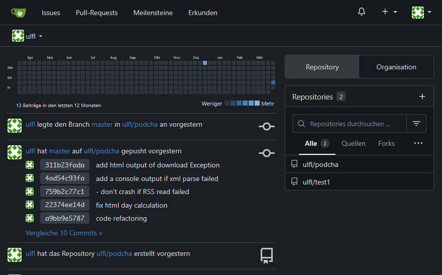
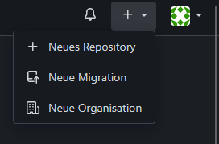

# gitea

*Setup gitea as a self hosted git server container (aka: forge).*

The [forge](forge.md) page lists why I've chosen gitea.



*Remarks: My switch from git with plain ssh to gitea is fresh. I have no long term experiences (smooth updates?) with gitea while I write this in 2025.*

---

## gitea container with docker-compose.yml

I'm using docker to run gitea in a container.

Gitea has a good docker usage explanation at: https://docs.gitea.com/installation/install-with-docker

I'm using the default docker-compose.yml as suggested:

```
version: "3"

networks:
  gitea:
    external: false

services:
  server:
    image: gitea/gitea:latest
    container_name: gitea
    environment:
      - USER_UID=1000
      - USER_GID=1000
    restart: always
    networks:
      - gitea
    volumes:
      - ./gitea:/data
      - /etc/timezone:/etc/timezone:ro
      - /etc/localtime:/etc/localtime:ro
    ports:
      - "3001:3000"
      - "222:22"
```

After the usual:

```
docker-compose up -d
```

I can open my instance at:

http://server.lan:3001/

## Configuration

Beside the typical user creation at the first container start, there was no additional configuration required. Don't forget to note the user credentials.

A gitea configuration overview is at: https://docs.gitea.com/administration/config-cheat-sheet

---

## Migrating Repositories From Simple ssh to gitea

I was using repositories that directly used ssh to my local server with a remote origin like:

```
> git remote get-url origin
ulfl@server.lan:/data/system/git/abc
```

**The migration tool in the gitea Web-UI fails to migrate this**.

I won't go into details, see: https://github.com/go-gitea/gitea/issues/1635

Instead I've used a "semi manual" way ...

### Migration Overview

For each git repository:

1. create an empty repo in gitea
2. clone old repo locally
3. set origin to gitea server
4. push

As I have only about 10 repos to migrate, doing these steps manually is ok for me as it only has to be done once per repo.

### Create an Empty Repo in gitea

Create a new repo (named e.g. abc) with the gitea Web-UI, in my case at: http://server.lan:3001/



As my gitea instance runs on server.lan port 3001, I can access the new repo "abc" at:

http://server.lan:3001/ulfl/abc

### Clone locally

If not done already, clone the old repository to a local machine:

```
git clone ulfl@server.lan:/data/system/git/abc
```

### Set new origin

Switch to the new server location:

```
cd abc
git remote set-url origin http://server.lan:3001/ulfl/abc
```

### Push

... and push it to the new server:

```
git push origin master
git push --tags
```

### Further Steps

To avoid mistakes of working on the old repo, I've simply renamed it at the old location.

Adding a one line description in the repo settings helps to orient.

While looking at some program repos that I've done years ago, I couldn't even remember how to start the program. Adding a readme would helped a lot. To lower the step to actually do this in the future, I've created a [Readme.md template for programs](readme-template-program.md).
