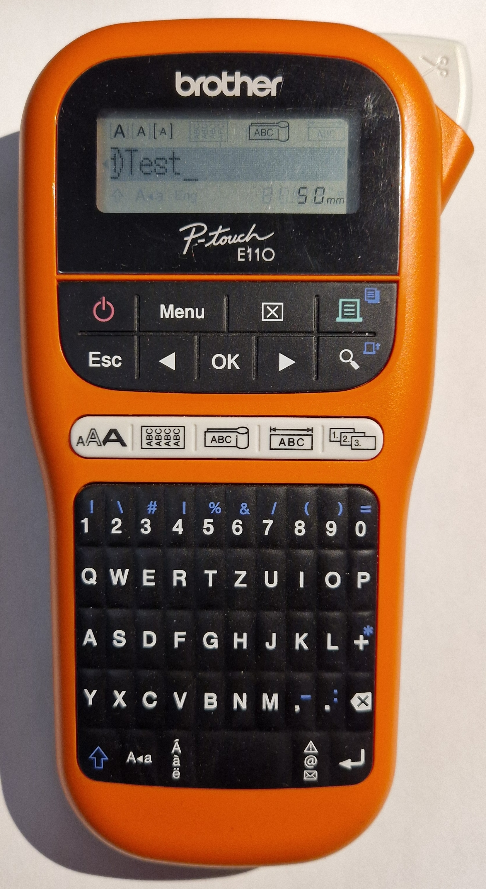

# P-Touch Cable Marking

Marking cables can be quite helpful if you have more than just a few.

*Some remarks: I've collected the infos on this page in 2025. They may be wrong, incomplete or get outdated over time. Please raise a GitHub issue for corrections. The printed labels were created using "TZe compatible" tapes, the results with genuine Brother tapes may be different.*

For general infos about the P-Touch printers, see: [P-Touch Printers](./P-Touch-Printers.md)

*Cable markers on a 19" patch panel*

For the above cables, normal 12 mm tape (TZe-231 "compatible") was used with a PT-E110 printer. Especially the label on the middle black cable does not stick well as the cable is pretty thin.

Hint: In a professional environment, you may need to use certified labels (ULN, ANSI/TIA-606C, or other organizations) for such markings.

## Keep it simple?

You can just print a label on normal tape, leave the usually cut off "prefix tape", wrap it around the cable as in the image above and you're done.

*Normal 12 mm print*

Well, this has some drawbacks:

1. the print is a bit "wrapped around", especially at the starting "C"
2. the print is only on one side
3. the normal tape often won't stick well with thin cables

The first two disadvantages shows up when searching for a specific cable, as you need to twist all the cables until you find the right one. To circumvent this, Brother provides special cable marking modes with the "E-series" of printers.

After a while, especially on thin cables, the normal laminated tape often will not stick well with the cable. To circumvent this, Brother sells special tapes for cable markings.

---

## "E-series" Printers

The E-series printers (PT-E100, PT-E110, PT-E300, PT-E550W, PT-E800T and PT-E850TKW) have special modes to print cable wraps and cable flags. You can also print special electrical and warning symbols. The PT-E300 and higher can print HSe heat shrink tubes, the PT-E550W and higher have a computer interface and further options.

A list of E-series printers to compare can be found at: https://www.brother.com.sg/en/labellers/all-labellers?fr=electrical_automation

TODO: Check if it's possible to use such electrician options with the Windows software on other printers?

*Brother PT-E110 in "cable flag" mode*

### Cable Flag

*"cable flag" printed by the PT-E110*

The PT-E550W manual suggests:

* 3-90 mm cable diameter
* use flexible (TZe-FXxxx) or self laminating (TZe-SLxxx) tape

After a while, especially on thinner cables, the normal laminated tape (TZe-xxx) often will not stick well with the cable. It will not fall of as the "flag" part keeps sticking, but you can move it along the cable.

### Cable Wrap

*"cable wrap" printed by the PT-E110*

The PT-E550W manual suggests:

* min. 3 mm cable diameter
* min. 5 mm overlap
* use flexible tape (TZe-FXxxx)

May not work well with:

* flat cables
* longer texts on thin tapes

---

## Special Tapes

Special tapes for cable markings.

Some infos about tapes for electricians: https://www.brother.com.sg/en/contents/labeller-for-electrician

| Model number | Description | Remarks | Length |
| --- | --- | --- | --- |
| TZe-FXxxx | flexible ID | for thin cables (min. 3 mm diameter) | 8 m |
| HSe-xxx | heat shrink tube | shrink rate 2:1 | 1,5 m |
| HSe-xxxE | heat shrink tube | shrink rate 3:1 | 1,5 m |
| FLe-xxx | flags | 72 pre-cut flags, especially for small diameter (fibre optic cables) | 72 flags |
| TZe-SLxxx | self laminating | especially for CAT network cables ? | 8 m |
| - | - | **Other tapes for electricians use:** | - |
| HGe-xxx | high grade | for harsh environments (UV, temperatures, chemicals) | 8 m |
| TZe-Sxxx | strong adhesive | for structured surfaces | 8 m |

I don't have real experience with these special tapes so far.

### TZe-FXxxx "Flexible ID"

As mentioned above, the normal laminated tapes may not stick well with small diameter cables. Brother suggests using these flexible tapes for cable flags or wraps.

Available colors (in 6-36 mm widths):
* black on white (2x1)
* black on yellow (6x1)

In the PT-E550W manual you'll find hints that the cable diameter should not be smaller than 3 mm.

TODO: I'm still experimenting if the TZe-Fxxx really sticks better compared to the normal tape.

### HSe-xxx and HSe-xxxE "Heat Shrink Tube"

Heat shrink tubes are (in principle) nice for cable markings and are available for diameters as small as 0.8 mm. In practice, I'm mostly using pre-configured cables where this doesn't really help as you cannot get the tube over a much larger fixed connector.

| Tape | Width | Target Diameter | Shrink Rate |
| --- | --- | --- | --- |
| HSe-x11 | 5,8 mm | 1,7-3,2 mm | 2:1 |
| HSe-x21 | 8,8 mm | 2,6-5,1 mm | 2:1 |
| HSe-x31 | 11,7 mm | 3,6-7,0 mm | 2:1 |
| HSe-x41 | 17,7 mm | 5,4-10,6 mm | 2:1 |
| HSe-x51 | 23,6 mm | 7,3-14,3 mm | 2:1 |
| HSe-x11E | 5,2 mm | 0,8-3,1 mm | 3:1 |
| HSe-x21E | 9,0 mm | 1,6-5,4 mm | 3:1 |
| HSe-x31E | 11,2 mm | 2,1-7,0 mm | 3:1 |
| HSe-x51E | 21,0 mm | 4,2-13,5 mm | 3:1 |

Available colors:
* black on white (2x1)
* black on yellow (6x1)

As the tube is only 1.5 m long and a genuine Brother cassette cost more than 20€, this can become a bit expensive for hobbyists use. However, cheaper "compatible with HSe..." tubes are available (but it seems only with the 2:1 shrink rate).

Most P-Touch tapes are laminated with a transparent foil on top for (scratch) resistance. The shrink tubes are printed directly and have no such protection, I don't know how "long term stable" the printing on the tube actually is.

#### HSe-xxx(E) Printer Compatibility

According to Brother, the following printers should work with HSe-xxx tubes: PT-D800W, PT-E300, PT-E300VP, PT-E550W, PT-E550WVP, PT-P700, PT-P750W, PT-P900W, PT-P900Wc, PT-P950NW. I've taken these infos from the Brother "TZe-Tape Comparison Chart" pdf (2017) and the german "Brother P-touch Pro Tapes" pdf (2023).

The "Brother Label Tape Hack" can be used to print HSe-xxx tubes with an otherwise "unwilling" PT-P300BT: https://hackaday.io/project/190126-brother-label-tape-hack

I'm not sure if such limitations apply to the older TZ-series printers and if "compatible with HSe" tapes have the same limitations.

### FLe-xxx "Flags"

https://www.brother.com.sg/en/contents/labeller-for-electrician indicates:

* pre-cut "flags" with long tail
* ideal for fibre optic cables
* for diameters of 2.0mm to 8.0mm
* for PT-E800T, PT-E850TKW, PT-P900W, and PT-P950NW only

Available colors:
> FLe-2511: black on white

> FLe-6511: black on yellow

> FLe-7511: black on green
