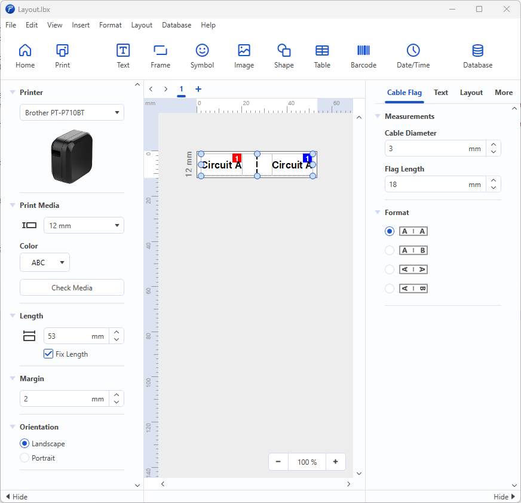

# Windows Software for the P-Touch Printers

Collected quirks of using my PT-P710BT printer under Windows ...

*Some remarks: I've collected the infos on this page in 2025. They may be wrong, incomplete or get outdated over time. Please raise a GitHub issue for corrections. The printed labels were created using "TZe compatible" tapes, the results with genuine Brother tapes may be different.*

*P-Touch Editor 6 while editing a cable flag*

## Installation
"Software/Document-Installer"
* During installation, you have to enter the printers serial number, but only the last 9 characters. If you enter the full serial number as seen on the printer, the installation won't continue.
  * why can't this be "clipped" to the last 9 chars automatically by the installer?
  * why do I have to enter the serial number by hand at all, if the printer is connected and could know its own serial number
  * why is entering the serial number necessary at all?
* After installation, my Desktop is spammed with 5(!) new icons.
* To configure some optional printer settings (like the "auto power off time"), a separate "Printer Setting Tool" is installed. This should be integrated into the "P-Touch Editor" software.

## Connection
The PT-P710BT can only be connected to the PC via micro USB.

**A connection of the PT-P710BT over Bluetooth isn't possible.**
The manual says "This label printer does not support Bluetooth connections for computers.". Well, I didn't know that my Android smartphone isn't a computer.

*So each time I want to use the PT-P710BT under Windows, I have to look for the USB cable and connect it to the fiddly micro USB port - although both the PC and the printer have Bluetooth.*

## Usage
P-Touch Editor 6, version 6.6.0.0 (latest version in 2025)

Pros
* A wide range of label designs are available (including electrical labels)
* Compared with the standalone printers, having a print preview is nice

Cons
* Software is from 2022, so in 2025 no updates for about 3 years
* The GUI has no "dark mode". Brother, we have 2025 now ...
* When I've selected the "View" menu for the first time, the program simply freezed. Didn't happen again.
* When the GUI language is changed, you need to restart the program for changes to take effect.
* Dialogs can't be closed by pressing the ESC key.
* The "Home" dialog doesn't remember the last selected label and always starts at the top of a looong list.

## Conclusion
Having a long list of label designs to choose from (incl. electricians labels) and a print preview is nice.

The PT-P710BT can't be connected over Bluetooth, so each time I want to print, I need to deal with the fiddly micro USB port of the printer.

Although the software feels a bit "uncomfortable" here and there, it does its job.
