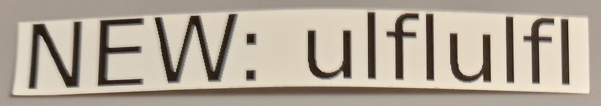

# ptouch-print

Review of the ```ptouch-print``` linux command line tool for P-Touch USB printers.

The tool can be used to generate and print labels from the command line. In addition tape infos can be retrieved, which sometimes helps to understand the behavior of "compatible" tapes. The tool is written in C and uses libusb to directly talk to the printer.


*QR code label created with ptouch-print and qrencode*

> :bulb: **Tip:** ptouch-print supports many USB printers, "Bluetooth only" printers (e.g. PT-P300BT) are not supported.

Table of Contents:
* [Installation](#installation)
* [Parameter Overview](#parameter-overview)
* [Program Infos](#program-infos)
* [Tape Infos](#tape-infos)
* [Generate .png](#generate-png)
* [Print](#print)
* [QR Code](#qr-code)

Resources:
* Project page: https://dominic.familie-radermacher.ch/projekte/ptouch-print/
* git repository: https://git.familie-radermacher.ch/linux/ptouch-print.git/
* Nice tutorial: https://github.com/HenrikBengtsson/brother-ptouch-label-printer-on-linux

*Some remarks: **I am not the author of ptouch-print**, I've just collected the infos on this page in 2025 for my personal use. The infos may be wrong, incomplete or get outdated over time. Please raise a GitHub issue for corrections.*

---

## Installation

> :memo: **Note:** I've successfully tried ptouch-print with **Linux Mint 22** (Ubuntu or Debian should be very similar, other distributions may also work) ...

There are no prebuilt packages available, so you need to compile the tool on your own ...

### Install Required Tools and Libraries

```
sudo apt install git gcc cmake gettext libgd-dev libusb-1.0-0-dev
```

### Clone repository

```
git clone https://git.familie-radermacher.ch/linux/ptouch-print.git
```

### Build

```
cd ptouch-print
./build.sh
```

There may appear some "statement with no effect" warnings that can be ignored.

### Check Build

```
build/ptouch-print --version
```

Output should be something like:

```
$ build/ptouch-print --version
ptouch-print version v1.6.r0.gaa5392b by Dominic Radermacher
```

### Install

```
sudo make -C build/ install
```

---

## Parameter Overview

```
$ ptouch-print --help
usage: ptouch-print [options] <print-command(s)>
options:
	--debug			enable debug output
	--font <file>		use font <file> or <name>
	--fontsize <size>	Manually set fontsize
	--writepng <file>	instead of printing, write output to png file
	--force-tape-width <px>	Set tape width in pixels, use together with
				--writepng without a printer connected.
	--copies <number>	Sets the number of identical prints
print commands:
	--image <file>		print the given image which must be a 2 color
				(black/white) png
	--text <text>		Print 1-4 lines of text.
				If the text contains spaces, use quotation marks
				around it.
	--cutmark		Print a mark where the tape should be cut
	--pad <n>		Add n pixels padding (blank tape)
	--chain			Skip final feed of label and any automatic cut
other commands:
	--version		show version info (required for bug report)
	--info			show info about detected tape
	--list-supported	show printers supported by this version
```

There is also a manpage available ```man ptouch-print``` with some additional infos.

---

## Program Infos

(Infos of v1.6 from 2025)

Check version

```
$ ptouch-print --version
ptouch-print version v1.6.r0.gaa5392b by Dominic Radermacher
```

List of supported printers:

```
$ ptouch-print --list-supported
Supported printers (some might have quirks)
	PT-2420PC
	PT-2450PC
	PT-1950
	PT-2700
	PT-1230PC
	PT-2430PC
	PT-2730
	PT-H500
	PT-E500
	PT-P700
	PT-P750W
	PT-D410
	PT-D450
	PT-D460BT
	PT-D600
	PT-D610BT
	PT-P710BT
```

I've noticed that my PT-P300BT is NOT supported, very likely as that printer only has Bluetooth and ptouch-print only supports USB.

The current list of supported printers can be found in the sources (look for ptdevs) at: https://git.familie-radermacher.ch/linux/ptouch-print.git/tree/src/libptouch.c

---

## Tape Infos

If the printer is turned off (or not connected), you'll simply get:

```
$ ptouch-print --info
No P-Touch printer found on USB (remember to put switch to position E)
```

When it's turned on, you may get:

```
$ ptouch-print --info
PT-P710BT found on USB bus 2, device 4
libusb_open error :LIBUSB_ERROR_ACCESS
```

This indicates permission problems accessing USB, so I used sudo:

```
$ sudo ptouch-print --info
PT-P710BT found on USB bus 2, device 5
maximum printing width for this tape is 76px
media type = 01 (Laminated tape)
media width = 12 mm
tape color = 01 (White)
text color = 08 (Black)
error = 0000
```

... as the tape used was a "genuine TZe-231" (12 mm laminated "black on white" tape), all values made perfect sense.

### Tape Identifications

 Various identifications of genuine and "compatible" tapes.

| Tape | Genuine | Width | Media Type | Media Width | Tape Color | Text Color | Remarks |
| --- | --- | --- | --- | --- | --- | --- | --- |
| TZe-231 | x | 76 px | 01 (Laminated tape) | 12 mm | 01 (White) | 08 (Black) | genuine Brother TZe-231 tape |
| TZc-231 | - | 76 px | 01 (Laminated tape) | 12 mm | 01 (White) | 08 (Black) | identification ok |
| UB-231 | - | 76 px | 01 (Laminated tape) | 12 mm | **08 (Black)** | **01 (White)** | Actually a 12 mm black on white tape, so tape/text color is interchanged. Anyway, prints without problems. |
| TZc-251 | - | 128 px | 01 (Laminated tape) | 24 mm | 01 (White) | 08 (Black) | identification ok |
| TZc-FX231 | - | 76 px | **01 (Laminated tape)** | 12 mm | 01 (White) | 08 (Black) | As this should be a flexible "FX" tape, I'm not sure if "media type" is correct or not. The C source code knows special 0x14 for "Flexible ID" tapes |
| TZc-S231 | - | 76 px | 01 (Laminated tape) | 12 mm | 01 (White) | 08 (Black) | identification ok. The source code don't know about special "strong adhesive tapes" |
| KZe-211 | - | 32 px | 01 (Laminated tape) | 6 mm | 01 (White) | 08 (Black) | identification ok |
| None | - | 0 px | 00 (No media) | 0 mm | 00 (unknown) | 00 (unknown) | ... "no tape" just for completeness |

More infos about the tape cassette holes and the corresponding printer sensing pins at:  [P-Touch Printers](./P-Touch-Printers.md#how-the-printer-identifies-the-tape-cassette)

The list of all infos available from ptouch-print can be found in the sources (look for the lists of: tape_info, media_type, tape_color and text_color) at: https://git.familie-radermacher.ch/linux/ptouch-print.git/tree/src/libptouch.c

### Tape Widths and Pixel Parameters

| Tape Width                         | mm | 3.5 |  6  |  9  |  12 |  18 |  24 |  36 | Remark |
| ---                                | --- | --- | --- | --- | --- | --- | --- | --- | --- |
| ```force-tape-width```             |  pixel | 24 |  32 |  52 |  76 | 120 | 128 | 192 | Optional parameter. The values are the default (max.) pixel widths |
| ```fontsize``` (for a single line) |  pixel | 18 |  26 |  46 |  60 | 108 | 114 | 176 | Optional parameter: Slightly reduced fontsize for a small top/bottom spacing |

By using the *force-tape-width* parameter you don't need an attached printer for .png file generation.

With the default fontsize no top / bottom spacing is created (as you will see below). I've experimented with the fontsize parameter to get some nice margin and have put these values in the table above. These values may be specific to my PT-P710BT, your mileage may vary.

---

## Generate .png

```ptouch-print``` can generate .png files for a preview or later printing.

> :bulb: **Tip:** To avoid errors, either connect and power on the printer or use the parameter ```force-tape-width```

Generate a simple label .png by using the ```text``` and ```writepng``` parameters:

```
ptouch-print --text "ulflulfl" --writepng example1.png
```


*example1: A single line of text for 12 mm tape*

With 12 mm tape, a .png with 76 pixels width is created:

```
$ file example1.png
example1.png: PNG image data, 296 x 76, 1-bit colormap, non-interlaced
```

Generate a label with two or three lines, by adding more texts after the ```text``` parameter:

```
ptouch-print --text "ulflulfl" "+49 89 32168" --writepng example2.png
```


*example2: Double text lines*

```
ptouch-print --text "ulflulfl" "+49 89 32168" "ulflulfl@example.org" --writepng example3.png
```


*example3: Triple text lines*

Generate **two labels** in one png to save some tape (avoids the second ~2 cm "prefix tape"), add a ```cutmark``` and some ```pad``` spaces of 10 pixels:

```
ptouch-print --text "ulflulfl" --pad 10 --cutmark --pad 10 --text "+49 89 32168" --writepng example4.png
```


*example4: Two labels in a row to save some tape*

While the actual print adds a very tiny spacing at the top and bottom (1 pixel each side?), I like to have a slightly larger spacing. Use the ```fontsize``` parameter to reduce the text size (here: 12 mm tape with max. 72 pixels using 60 pixel font)

```
ptouch-print --fontsize 60 --text "ulflulfl" --writepng example5.png
```


*example5: Top and bottom margins by using a reduced fontsize*

---

## Print

You can print with any combinations of the ```text```, ```image```, ```cutmark``` and ```pad``` parameters.

> :bulb: **Tip:** It's a good idea to preview a .png before printing to avoid wasted tape

Print a mix of text and a pre-generated .png image:

```
$ ptouch-print --text "NEW: " --pad 10 --image example1.png
```


*printed label with a mix of text "NEW: " and a pre-generated image of the text "ulflulfl"*

The blurriness is caused by my camera, the label is pin sharp.

---

## QR Code

Labels with QR Codes can be created using qrencode (or alike tools).

### Install qrencode

```
sudo apt install qrencode
```

### Generate the QR Code .png

```
qrencode -o qr.png -m 0 -s 3 https://github.com/ulflulfl
```

After some experiments with the margin and (pixel) size parameters, qrencode creates a .png with 75x75 pixels, which fits nicely in the 76 px max width of 12 mm tape.


*QR code generated by qrencode that links to: https://github.com/ulflulfl*

```
$ file qr.png
qr.png: PNG image data, 75 x 75, 1-bit colormap, non-interlaced
```

### Generate the Label .png

```
ptouch-print --image qr.png --pad 10 --text "https://" "github.com" "ulflulfl" --writepng example6.png
```


*example6: QR code with some text*

### Print

```
ptouch-print --image example6.png
```

Although the QR Code is pretty small on 12 mm tape, my smartphone has no problems decoding it.
