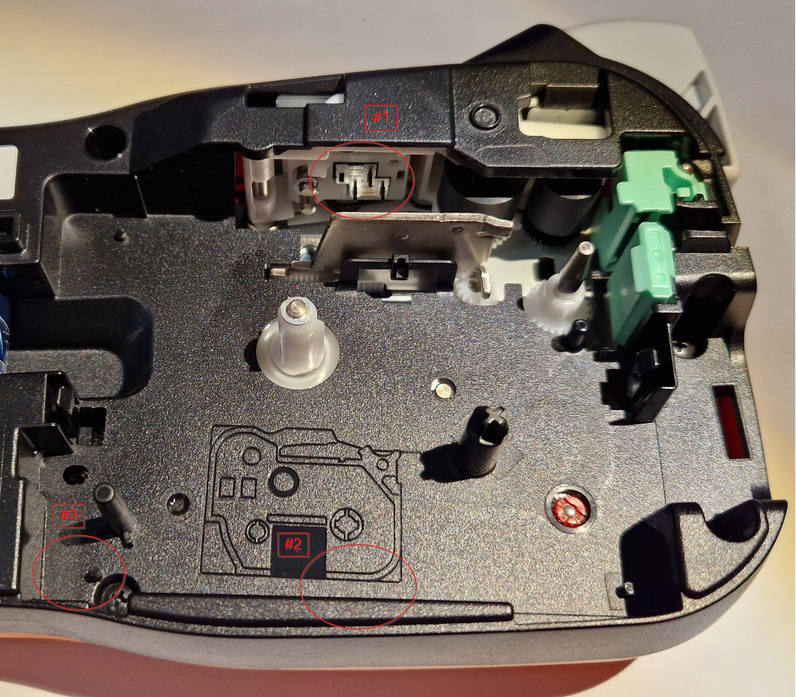

# Brother P-Touch Printers

Various infos about some of the more affordable label printers of the Brother P-Touch (PT) series.

I've started with a cheap handheld printer and gained experience over the years with the PT printers. I haven't tried other Brother label printers (QL, TD, ...) or label printers from other brands.

> **All in all, having a label printer to mark boxes and many other stuff is invaluable for me to keep things in order. A simple printer for 12 mm "black on white" tape is enough for that. For me, everything else is just nice to have - but why not have some fun with it ...**

*Some remarks: I've collected the infos on this page in 2025. They may be wrong, incomplete or get outdated over time. Please raise a GitHub issue for corrections. The printed labels were created using "TZe compatible" tapes, the results with genuine Brother tapes may be different.*

For detailed infos about:
* [Tape Cassettes](./P-Touch-Tape-Cassettes.md) - the (TZe, HSe, ...) tape cassettes
* [Cable Markers](./P-Touch-Cable-Markers.md) - how to mark cables
* [Windows](./P-Touch-Windows.md) - some quirks of using P-Touch under Windows
* [Linux](./P-Touch-Linux.md) - the options to use P-Touch under Linux

*My P-Touch printers (front row left to right: TCM 232288, PT-1000, PT-E110, rear: PT-P300BT, PT-P710BT)*

---

## Choosing the Right Printer

As Brother provides many different printer models (the Brother website currently lists 69 P-Touch models), choosing the right one can be a bit difficult.

### Brother Website
Brother provides infos about the P-Touch printers on their website.

Some examples for my PT-P710BT:

* Product page (german): https://store.brother.de/catalogs/brothergermany/geraete/etikettendrucker/p-touch/pt/ptouchcubeplus-ptp710bth
* Support page, including manuals (german): https://www.brother.de/support/ptp710bt
* USB Protocol Description (english): https://support.brother.com/g/b/manualtop.aspx?c=us&lang=en&prod=p710bteus

### Criteria for a Purchase

Several points about the printer usage to think about:

* Label printing only once a while or daily use?
* Handheld/Standalone, Desktop (USB for Windows, Mac, Linux) or mobile (Bluetooth for Android, Mac, Linux) use?
* Display & keyboard needed? ... or computer usage only?
* Graphics like QR- or barcodes needed?
* Electrician features (cable markers, special symbols) needed?
* Printer dimensions and weight (desktop only or mobile/travel use?)
* Manual or (the comfort of an) automatic cutter?
* Batteries, Li-Ion or mains power?
* Price?

The printer and the intended tape must also match:

* Wide tape needed? 12 mm tapes are ok for most cases, wider tapes may be needed to be seen from "further away"
* Special tape materials needed (like heat shrink tubes)?
* Special certifications needed (e.g. for professional cable markings)?

Most "normal" TZe tapes can be printed with any printer, special tapes (HGe, HSe, ...) need special printers - more on that at: [P-Touch Tape Cassettes](./P-Touch-Tape-Cassettes.md)

---

## My Printers

| Model | Power | Display | Keyboard | Dimensions | Weight* | Cutter | Tapes | Interfaces | Price | Purchased |
| --- | --- | --- | --- | --- | --- | --- | --- | --- | --- | --- |
| TCM 232288 | 6xAAA | 8x1 | ABCDE | 108x196x55 mm | 332 / 401 / 444 g | Manual | 6-12 mm | - | 20 € ? | << 2016 |
| PT-1000 | 6xAAA | 8x1 | ABCDE | 108x196x55 mm | 335 / 405 / 445 g | Manual | 6-12 mm | - | 25 € | 2016 |
| PT-E110 | 6xAAA | 16x1 | QWERTZ | 111x58x204 mm | 399 / 466 / 496 g | Manual | 3,5-12 mm | - | 35 € | 2022 |
| PT-P300BT | 6xAAA | - | - | 115x61x115 mm | 383 / 450 / 490 g | Manual | 3,5-12 mm | Bluetooth | 40 € | 2025 |
| PT-P710BT | Li-Ion | - | - | 128x67x128 mm | ----- / 631 / 670 g | Automatic | 3,5-24 mm | USB & Bluetooth | 80 € | 2025 |

*Weight: empty / with batteries / with batteries & TZe231 tape

Some relatively cheap alternatives with computer interfaces in 2025: The cheapest one with display and keyboard that can also be used with Windows (and Linux) is the PT-D410 (~45 €). Other options (~60-90 €) are: PT-D450, PT-D460, PT-H500 and PT-P700.

### TCM 232288

*TCM 232288 (Tchibo rebranded PT-1000)*

I've purchased this printer at German "coffee roaster" Tchibo many, many years ago. As you can see from the scratches it was used quite a lot.

As this is very likely a rebranded Brother PT-1000, see details there.

### PT-1000

*Brother PT-1000*

After many years of usage, the TCM printer mentioned above showed its age and the cutter wasn't working well (at that time I wasn't aware that you can replace the cutter). So I've just purchased the "same" model again.

* Product page (german): https://store.brother.de/catalogs/brothergermany/geraete/etikettendrucker/p-touch/pt/pt1000
* Support page (german): https://www.brother.de/support/pt1000/
* Tapes: 6-12 mm TZe (new) & TZ (old) tapes
* Cutter: Manual (TC-5, replaceable)
* Power: 6xAAA or Brother AD-24ES (9V 1,6A, :warning: **Warning: Barrel connector with uncommon polarity "positive outside"**)
* Computer interface: None

:+1: Pros:

* works well, no quality problems even after years of moderate use
* 12 mm width suitable for most use cases
* batteries last long

:-1: Cons:

* limited for printing cable markers
* not suitable for graphics: QR-codes, Barcodes, ...

TODO: As this is an older TZ printer, check if it can print special "PRO" tapes that seems to be limited with the newer TZe printers.

### PT-E110

*Brother PT-E110*

The PT-E110 is specialized for electricians use, e.g. with special modes to print cable markings or electrical symbols.

I've purchased the PT-E110 (on a special offer) especially to print cable markers, which works nicely.

More about electricians use at: [P-Touch Cable Markers](./P-Touch-Cable-Markers.md)

Variants:

* PT-E110
* PT-E110VP (with mains power adapter and hard case)

General properties:

* Product page (german): https://store.brother.de/catalogs/brothergermany/geraete/etikettendrucker/p-touch/pt/pte110
* Support page (german): https://www.brother.de/support/pt-e110
* Tapes: 3,5-12 mm TZe & HGe ("High-Grade") tapes (will not work with the much older TZ tapes)
* Cutter: Manual (TC-4, replaceable)
* Power: 6xAAA or Brother AD-24ES (9V 1,6A, :warning: **Warning: Barrel connector with uncommon polarity "positive outside"**)
* Computer interface: None

:+1: Pros:

* works well
* "cable flag mode" is very useful for cable markers
* beside the "electricians specials", somewhat similar to the PT-1000

Neutral:

* I'm not using the "cable wrap mode" or "electrical and warning symbols" at all

:-1: Cons:

* HSe heat shrink tubes NOT supported

TODO:

* Try out the "faceplate mode"
* Check if "HSe compatible" heat shrink tubes can be printed

### PT-P300BT "P-Touch Cube"

*Brother PT-P300BT*

*Brother PT-P300BT - side view with manual cutter and tape outlet*

After buying the PT-P710BT (see below), I bought a used PT-P300BT for cheap. As there is Linux software especially for this model available, I wanted to give that a try.

General properties:

* Product page (german): https://store.brother.de/catalogs/brothergermany/geraete/etikettendrucker/p-touch/pt/ptouchcube
* Support page (german): https://www.brother.de/support/ptp300bt
* Tapes: 3,5-12 mm TZe tapes (will not work with the much older TZ tapes)
* Cutter: Manual (TC-4, replaceable)
* Power: 6xAAA or Brother AD-24ES (9V 1,6A, :warning: **Warning: Barrel connector with uncommon polarity "positive outside"**)

Computer connection:

* Interface: Bluetooth (2.1+EDR class 2)
* Desktop software:
  * Windows: not supported
  * macOS: not supported
  * Linux: [P-Touch Linux](./P-Touch-Linux.md)
* Mobile Apps:
  * Android: Brother iPrint&Label, P-touch Design&Print 2
  * iOS: Brother iPrint&Label, P-touch Design&Print 2
* USB Protocol description: not available

Experiences:

* Purchased in 2025, so I have no "long term" experience
* TODO: Add experiences

### PT-P710BT "P-Touch Cube Plus"

*Brother PT-P710BT*

While I have good experience with the handheld devices mentioned above, I wanted to try a printer with a computer interface and an automatic cutter that can print wider 24 mm tapes.

Variants:

* PT-P710BT (black)
* PT-P710BTH (white)

General properties:

* Product page (german): https://store.brother.de/catalogs/brothergermany/geraete/etikettendrucker/p-touch/pt/ptouchcubeplus-ptp710bth
* Support page (german): https://www.brother.de/support/ptp710bt
* Tapes: 3,5-24 mm TZe tapes (will not work with the much older TZ tapes)
* Cutter: Automatic (not replaceable)
* Power: Li-Ion battery (Brother PA-BT-005, included and replaceable), charged over micro USB (5V 0,5-2A, charger not included)

Computer connection:

* Interfaces: Micro USB (USB 2.0 Full Speed) & Bluetooth (2.1+EDR class 2)
* Software page (german): https://support.brother.com/g/b/downloadtop.aspx?c=de&lang=de&prod=p710bteuk
* Desktop software:
  * Windows (only USB): P-touch Editor, Printer Setting Tool, P-touch Update Software, see: [P-Touch Windows](./P-Touch-Windows.md)
  * macOS (only USB): P-touch Editor, Printer Setting Tool, Transfer Express
  * Linux: [P-Touch Linux](./P-Touch-Linux.md)
* Mobile Apps:
  * Android: Brother iPrint&Label, P-touch Design&Print 2
  * iOS: Brother iPrint&Label, P-touch Design&Print 2
* USB protocol description (english): https://support.brother.com/g/b/manualtop.aspx?c=us&lang=en&prod=p710bteus "Raster Command Reference"

:+1: Pros:

* works well
* automatic cutter is nice, but not an absolute must have
* printing small graphics (e.g. QR-codes, Barcodes, ...) is nice to have for me
* 24 mm wide tapes can be helpful from time to time (e.g. for graphics), 12 mm is enough in almost all cases

:-1: Cons:

* when standing upright, the printer is a bit wobbly
* The micro USB port is fiddly (as usual), USB-C would be nice in 2025

Purchased in 2025, so I have no "long term" experience

---

## Long Term Printer Experiences

Even my oldest printer - the rebranded TCM from Tchibo, purchased MANY years before 2016 - still works in 2025.

After so many years of usage, the tape cutter of the TCM is becoming blunt and cutting the tape gets difficult. Turning the cutter around as described in the PT-P300BT manual helped (let's see how long). At least the cutter unit is replaceable and still available in 2025.

The typical "problem areas" of such electronics after many years - display and rubber keyboard - still work just fine.

The 6xAAA batteries last quite a long time for me. With moderate usage I've changed the batteries maybe 2 or 3 times in all these years.

> :+1: All in all, I'm pleased with the P-Touch experience

---

## History of TZe (new) vs. TZ (old) System

As of 2025, only TZe (HSe, ...) tapes and printers are sold. The older TZ system is out of production for many years now.

In the past, the TZ system of tape cassettes and printers were used. Sometime after 2010 (only a rough guess) Brother changed the tape cassettes to the new TZe system, which can also be used with the older TZ printers.

*Old TZ tape mark on a PT-1000 printer purchased 2016*

Sometime after 2016 (only  a rough guess) the printers also changed to the new TZe system, which cannot print on the older TZ tapes (the cassettes doesn't even physically fit into the printer).

*"New" TZe tape mark on a PT-E110 printer purchased 2022*

Compatibility of TZe/TZ tapes and printers:

| | TZe Printer | TZ Printer |
| --- | --- | --- |
| **TZe Tape** | ok | ok |
| **TZ Tape** | - | ok |

---

## How the Printer Identifies the Tape Cassette

The P-Touch printer needs to detect the capabilities of the cassette, at least:

* cassette is inserted (or not)
* width of the tape

... and there are probably more print relevant capabilities.

The P-Touch system uses holes in the cassette and sensing pins in the printer for that.

### Holes in the cassette

There seems to be three "areas" of such sensing holes:

| Area | Location | Max. number of holes/pins | System |
 --- | --- | --- | --- |
| #1 | beside the print head | 5 ? | TZe (newer) |
| #2 | bottom of the cassette in the middle | 6 ? | TZe (newer) |
| #3 | bottom of the cassette in one corner | 7 ? | TZ (older) |

*Hole area #1 beside the print head (Chinesium "knock-off" tape cassette)*

*Hole areas #2 and #3 at the bottom of the cassette (Chinesium "knock-off" tape cassette)*

Brother doesn't reveal the meaning of these holes (AFAIK). The following blog post (from 2017) indicates that the sensing hole areas #1 and #2 are new with TZe and wasn't there with the older TZ system that only used holes in area #3: https://ptouchman.blogspot.com/2017/02/tze-carts-have-side-pin-holes-on.html When I'm looking at my own printers, this seems to be right.

An enthusiast tries to collect/decode this, but the results are currently limited: https://github.com/GoganGogan/Brother-TZe-Tapes If you have additional infos about the **genuine** tape cassette holes, please open a github issue or create a pull request there. The holes I've seen in "knock-off" cassettes seems to be a bit random and are therefore not really trustworthy.

The "Brother Label Tape Hack" page has a more comprehensive list of the pin/hole meanings: https://hackaday.io/project/190126-brother-label-tape-hack

### Sensing Pins in the Printer

The printers uses different sets of hole/pin areas.

#### PT-1000

My handheld PT-1000 (from 2016) for "TZ Tape"

*PT-1000 sensing pins - only three pins in area #3 at the corner (areas #1 and #2 are not used)*

#### PT-E110

My handheld PT-E110 (from 2022) for "TZe Tape"

*PT-E110 sensing pins - only three pins in area #1 beside the print head (areas #2 and #3 are not used)*

#### PT-P300BT

My desktop PT-P300BT (from 2025) for "TZe Tape"

*PT-P300BT sensing pins - four pins in area #1 & five pins in area #2 (area #3 is not used)*

#### PT-P710BT

My desktop PT-P710BT (from 2025) for "TZe Tape"

*PT-P710BT sensing pins - five pins in area #1 & five pins in area #2 (area #3 is not used)*

In contrast to the other printers, the PT-P710BT is able to print on 18 and 24 mm wide tapes. I think the fifth pin in area #1 is used to detect these wider tapes.

#### PT-1090

Sensing pins in the PT-1090 (2016 or before), four pins in area #3 at the corner: https://softsolder.com/2020/04/19/cheapnified-brother-tz-label-cartridge/

### Compatibility of Cassette and Printer

More infos about the compatibility at: [P-Touch Tape Cassettes](./P-Touch-Tape-Cassettes.md#compatibility-of-cassettes-and-printers)

---

## Printer Accessories

Beside the [P-Touch Tape Cassettes](./P-Touch-Tape-Cassettes.md), there are only a few other accessory parts.

Brother parts for my printers:

| Part# | Part | For ... | Price |
| --- | --- | --- | --- |
| TC-5 | Manual tape cutter | TCM 232288, PT-1000 | from 5 € |
| TC-4 | Manual tape cutter | E110, PT-P300BT | from 5 € |
| PA-BT-005 | Li-Ion battery | PT-P710BT | from 35 € |
| AD-24ES | Mains Power adapter 9V 1.6A | TCM 232288, PT-1000, PT-E110, PT-P300BT | from 13 € |

TODO: Which barrel connection does the AD-24ES actually use? I guess 5.5/2.1 or 5.5/2.5 mm ...

*TC-5 manual tape cutter parts*

*TC-5 mounted in the PT-1000 printer*
