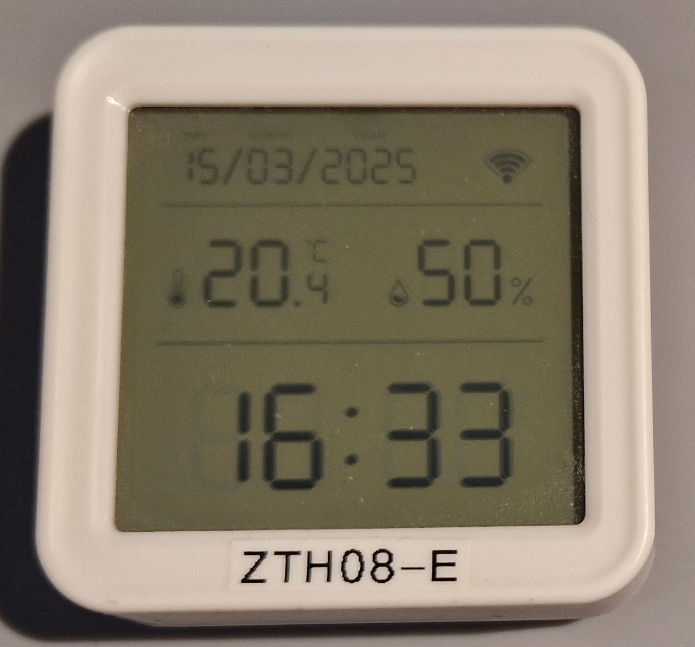
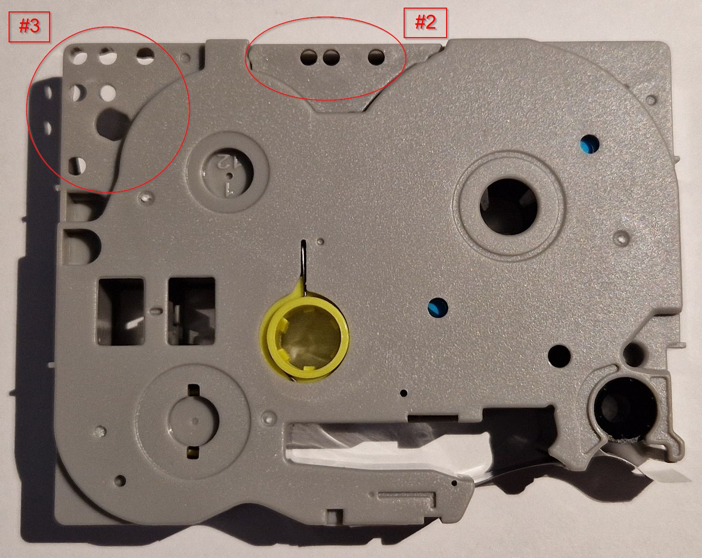

# Brother P-Touch Cassettes

Various Infos about the Brother P-Touch TZe, HSe, HGe, ... tape cassettes.

*Some remarks: I've collected the infos on this page in 2025. They may be wrong, incomplete or get outdated over time. Please raise a GitHub issue for corrections. The printed labels were created using "TZe compatible" tapes, the results with genuine Brother tapes may be different.*

For general infos about the P-Touch printers, see: [P-Touch Printers](./P-Touch-Printers.md)

---

## Brother Website

The Brother website contains infos about the various tapes. Some examples I've found helpful:

* The Brother tape cassette selector (german): https://www.brother.de/etiketten-und-belegdrucker/schriftbaender#T_12mm
* Overview pdf: https://www.brother.eu/-/media/product-downloads/devices/nordics/eu_en/labelling-machines/tze-tapeoversigt.pdf
* "Technical data for TZe, HGe and HSe tapes." pdf: https://www.brother.eu/-/media/pdf/nordics/tze-booklet-2019_eng_web.pdf

---

## Tape Cassette

*Chinesium knock-off: "Compatible with Brother TZe-231" tape cassette (12 mm black on white laminated tape)*

*"Compatible with Brother TZe-...": 6, 12 and 24 mm black on white laminated tape cassettes*

---

## Print Examples

*Please note: The labels are pin sharp, the blurriness is caused by my camera.*

*Labels 24, 12 and 6 mm wide, printed with single and double lines using a PT-P710BT*

In reality the characters of the last label, "double line 6 mm tape" are really tiny. My older PT-1000 cannot even print this.

*24 mm labels in 24 and 56 pt Helsinki font (PT-P710BT)*

*12 mm label with QR-Code (PT-P710BT)*

The QR-Code blurriness is caused by my camera, the label is pin sharp and works well when scanned with my smartphone. As the 12 mm label is pretty small for this, I tend to use 24 mm tapes here.

---

## Usage Examples

*12 mm label on an "Eurobox"*

*Double line printing to save tape and space*

*If I need a small sticker, I'll print only a single line with "double line printing" on 12 mm tape and cut it out with scissors.*

*Peeling off the "back foil" is usually easy, as it is split in the middle*

---

## Pricing and Alternatives
A Brother genuine TZe-231 tape starts at 10 €, special tapes can cost 25 € or more. If you use labels a lot or need a higher variety of different tapes, this can quickly become a bit expensive for hobbyists use.

On the other hand, you can get a pack of five "TZe-231 compatibles" from Aliexpress for under 10 €, or "For a Few Dollars More" from Amazon. Many other tapes are also available as "compatibles" (widths, colors, strong adhesive, flexible, heat shrink tube, ...) and will usually be only two to five Euros each.

While the Brother genuine tape uses the model number TZe-231, the knock-offs usually are titled "compatible with TZe-231" and uses similar model numbers, e.g. "KZe-231", "TZc-231" or "UB-231".

I'm using the "TZe-231 compatibles" for quite a while and quite a lot:

:+1: Pros:

* print looks very good
* wear resistant
* peeling off the "back foil" is easy, as that foil is split in the middle
* sticks well
* can usually be removed without residue
* cheap

:-1: Cons:

* very rarely: Peeling off the "back foil" can be a bit harder than normal -> but really no big deal
* may leave some residue on the surface if it was sticked on many years ago

I use my labels for "home and office", so no harsh daylight/UV, temperatures, chemicals and such. As I'm only using the compatible tapes (which works well for me), I can't tell if the genuine Brother tapes are better or maybe worse (which I wouldn't expect) ...

However, the following web page indicates that you may be unlucky with "knock-offs": https://softsolder.com/2020/04/19/cheapnified-brother-tz-label-cartridge/

---

## Tape Experiences

My experiences with the different tapes, your mileage may vary ...

### :+1: TZe-231 "12 mm Black on White" Tape - my personal default
The tape I typically use is the "TZe-231 compatible", a standard 12 mm laminated tape "black on white". It's "easy to locate", has a good contrast and 12 mm can be read from a moderate distance.

### :+1: TZe-251 "24 mm Black on White" Tape

I'm using the 24 mm tape if the label needs to be seen from a distance, or graphics like QR-codes are used (QR-codes on 12 mm are a bit tiny). In effect the 24 mm tape is only used from time to time and - at least for me - nice to have, but not a "must have".

### :question: TZe-211 "6 mm Black on White" Tape

I need very small labels only once in a while, so it's easier for me to print on 12 mm tape than to search for the 6 mm tape and change it in the printer. To get a small label, I'll use a 12 mm double line print, only use the first line of it and cut it out with scissors. Only in the very rare case that I need more than a few small labels, I can switch to 6 mm tape. Can be helpful, but not really necessary for me.

### :-1: TZe-131 "12 mm Black on Transparent" Tape
I've tried the "black on transparent" tape, but depending on the background color to stick it on, the label is much harder to locate and read compared to "black on white" tape. Might be helpful for usages where the label should be "less obvious", but I'm practically not using it.

### Other

TODO: Test heat shrink tube, strong adhesive, flexible, seal, colors, ...

---

## Compatibility of cassettes and printers

Most TZe tape cassettes can be used with all P-Touch printers, but there are some exceptions - especially for the so called "PRO" tapes.

Unfortunately, I find it a bit hard on the Brother webpages to get an idea which printers can print which tapes. I'm also unsure if the information is correct all the time. For example: When looking at the page for the TZe-FA3: https://store.brother.de/catalogs/brothergermany/verbrauchsmaterial/p-touch/schriftbaender/tze/tzefa3 it lists a lot of printers, but my PT-E110 is not mentioned there. I would be really surprised if the E110 cannot print that tape but many simpler printers can.

### Tape Width

The TZe tapes are available in widths of: 3.5, 6, 9, 12, 18, 24 and 36 mm, but many printers only support a subset of this range.

My handheld PT-1000 is a bit limited and can only print on: 6 - 12 mm tapes, I've not seen any printer so far with a more limited range. My PT-P710BT "P-Touch Cube Plus" on the other hand can print on: 3.5 - 24 mm tapes, so almost the full range.

### TZe vs TZ Tapes

Practically all tapes sold today are TZe (or HSe, HGe, FLe, STe) system tapes that physically fits in old TZ and current TZe printers.

Old TZ tapes were sold till somewhere around 2010 (or a bit later?) and are practically no longer available in 2025. The older TZ tapes will not work in the newer TZe printers. This is indicated by a comment on: https://ptouchman.blogspot.com/2017/02/tze-carts-have-side-pin-holes-on.html or in a short video: https://www.youtube.com/watch?v=YnFolCMM_A4

### "PRO" Tape Limitations

It seems Brother uses the cassette sense holes (described below) to block the specialized "PRO" tapes on many(?) printers. While these tape cassettes physically fit into all P-Touch printers, the printer just refuses to print. For example, something like the "Brother Label Tape Hack" seems to be needed to print HSe-xxx heat shrink tubes with an otherwise "unwilling" PT-P300BT: https://hackaday.io/project/190126-brother-label-tape-hack

Even worse, there seems to be no clear rule for this. I was expecting that the TZe tapes can print on any P-Touch machines while the "PRO" series tapes (HSe, HGe, FLe, STe) only prints on a limited set of printers. As an example in contrast to that, the german "Brother P-touch Pro Tapes" pdf lists the seal/tamper evident TZe-SEx tapes to be incompatible with my PT-E110 printer.

The "Tape Material" table further below lists the available tapes and wether it's considered as "PRO" or not.

### Tape Cassette Holes

Each tape cassette has a specific pattern of holes that identifies the tape width and such. These holes are sensed by the printer to identify the tape cassette.

*Hole area #1 beside the print head*

*Hole areas #2 and #3 at the bottom of the cassette*

More infos about the tape cassette holes and the corresponding printer sensing pins at:  [P-Touch Printers](./P-Touch-Printers.md#how-the-printer-identifies-the-tape-cassette)

---

## Order Number Scheme

The following tries to explain the Brother order number scheme for variations like:

* tape material (laminated, textile, heat shrink, ...)
* tape color
* width
* print color

All possible combinations would be more than a 1000 variations, so not all combinations from this scheme are actually available. In fact: The more specialized the tape material, the lesser variations are available. Two extremes: The "standard" laminated tapes (TZe-xxx) are available in many different widths and colors, while the "iron on" textile tape (TZe-FAx) are only available in 12 and 18 mm width as "blue on white" tape.

### Scheme Example: TZe-231

* ***TZe***-231 - TZe with three digit number, but without prefix or suffix -> normal laminated tape
* TZe-**2**31 -> 2xx -> white tape as "background color"
* TZe-2**3**1 -> x3x -> width 12 mm
* TZe-23**1** -> xx1 -> black print color as "foreground color"

TZe-231: 12 mm black on white tape

### Tape Material

Available tape materials of TZe, HSe, HGe, FLe and STe cassettes ...

| TZe-... | Material | Laminated | Example Use Case | Length | PRO |
| ------- | -------- | --------- |-------- | ------ | --- |
| TZe-xxx | "standard" tape | yes | universal | 8m (some only 4m or 5m) | - |
| TZe-Mxxx | matt tape | yes | universal | 8m | - |
| TZe-Sxxx | strong adhesive | yes | structured surfaces | 8m | PRO |
| TZe-FXxxx | flexible ID | yes | wrap around thin cables or pipes | 8m | PRO |
| TZe-AFxxx | acid free | yes | photo labelling | 8m | - |
| TZe-Nxxx | non laminated tape | no | slightly thinner & cheaper than laminated? | 8m | - |
| TZe-Rxxx | ribbon, textile string non sticky | no | string for birthday gifts | 4m | - |
| TZe-FAx | textile "iron on" | no | name sign in clothes | 3m | - |
| TZe-SEx | security / temper evident| yes | hard to remove seals | 8m | PRO |
| TZe-SLxxx | self laminating | yes | marking of network cables | 8m | PRO |
| TZe-CLx | print head cleaning | no | I've never needed this before | 100 uses | - |
| HSe-xxx | heat shrink tube, shrink rate 2:1| no | cable marking |  1,5 m | PRO |
| HSe-xxxE | heat shrink tube, shrink rate 3:1 | no | cable marking | 1,5 m | PRO |
| HGe-xxx | "high grade" | yes | highly resistant against UV, chemicals, ... | 8m | PRO |
| FLe-xxx | "Flag" (single cable markers) | yes ? | cable marking | 72 pieces | PRO |
| STe-xxx | stencil tape (printing small holes into the tape to apply acid for etching metal or glass) | no | permanent serial numbers | 3m | PRO |

***Before buying any of the "PRO" tapes, make sure that it works in the printer you use.***

Unfortunately, there seems to be no clear rules which printers can print which of the "PRO" tapes. Infos on the Brother website can give some hints, in question ask Brother or your dealer directly.

Infos about tape use for electricians at: [P-Touch Cable Markers](./P-Touch-Cable-Markers.md)

### Tape Color "Background"
* 1xx - transparent
* 2xx - white
* 3xx - black
* 4xx - red
* 5xx - blue
* 6xx - yellow
* 7xx - green
* 8xx - gold
* 9xx - silver
* Bxx - fluorescent orange
* Cxx - fluorescent yellow
* Dxx - fluorescent green (used by "compatibles" but not by Brother)
...

There are more colors available including glittering metal or pastel.

### Width
* x0x - 3.5 mm
* x1x - 6 mm
* x2x - 9 mm
* x3x - 12 mm
* x4x - 18 mm
* x5x - 24 mm
* x6x - 36 mm

The heat shrink tubes (HSe-xxx) use the same "numbering scheme" but have a slightly smaller width. More about heat shrink tubes at: [P-Touch Cable Markers](./P-Touch-Cable-Markers.md)

### Text Color "Foreground"
* xx1 - black
* xx2 - red
* xx3 - blue
* xx4 - gold
* xx5 - white
* xx6 - green (used by "compatibles" but not by Brother)

---

## Cassette Internals

* A short video of the internals: https://www.youtube.com/watch?v=IU1H_Hus_H8
* A longer video of the internals and how the print works: https://www.youtube.com/watch?v=W2SRePOg4VM
* A description of an older TZ style tape: https://softsolder.com/2016/04/25/brother-pt-1090-tape-cartridge-innards/

Internals of a "knock-off" that looks very different to what I've seen so far: https://softsolder.com/2020/04/19/cheapnified-brother-tz-label-cartridge/
